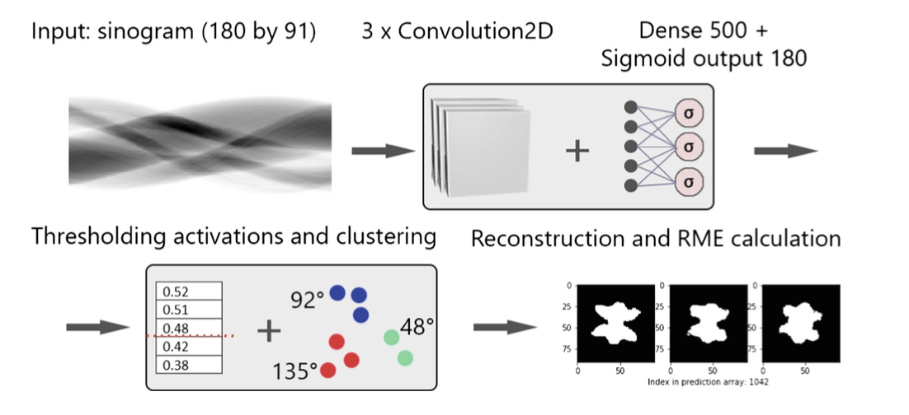

# Tomography-Reconstruction

## Structure description:
* *info*:
* * project_scope.pdf - scope of the project
* * CNN_paper.pdf - paper describing the CNN used for a similar task. 
* * 2013_Ultramicroscopy.pdf - describing the background behind the project

## Scope of the project:
* We're interetested in (possibly irregular) hexagons
* The aim is to find the angles to be scanned. Given that you can scan from 180 angles (360/2 since it's X-Ray). This is what CNN should output - 3 angles (3 angles for Hexagon, 2 angles for square etc.)
* Down the line we can use data from `2013_Ultramicroscopy` research
* Input to CNN -> sinogram of an image (of hexagon)
* Output of CNN -> a 180 size array w. value of `goodness` for each angle
* Input of software -> an image of hexagon
* Output of software -> 3 (2 for squares) best angles that should be used for reconstruction
* To get best angles given 180 angles, we can use k-means like in `CNN_paper`, although other solutions are possible

Other notes about scope:
* Possibly also implement reconstruction algorithm???
* Implement noise (add noise to sinograms)

## Paper description (most imporotant parts):
#### Intro 
* Intro speaks about sometimes it's not visible to gather all projections. If I understand correctely, Let's say we're given only 20 scans. Which projects should we choose? (Not sure if we choose from already scanned, or we choose angles to be scanned from, but definitely choosing the right ones has a *HUGE* impact as showed in other papers)
* "In the current literature we could not find any studies that con- centrate on how to solve the task of projection selection using machine learning algorithms" (especially CNN)
* "The main aim of this paper is to show that neural networks are capable of solving a complex task like projection selection without any reconstruction step (and to significantly decrease the running time of this process for the online scenario)." online scenario - the number of projections is not known in advance?

#### Section 2 - ANN & CNN Brief overview
* 2 dimenstional Convolutional layers for binary images case (since it's only black or white)

#### Section 3 - used CNN description
* 3 convolutional layers - (5, 5)(3, 3)(3, 3) kernel sizes
* Followed by "two fully connected dense layer with 500 and 180 units."
* ReLU activations
* Last Layer's sigmoid func
* "Between the convolutions we apply maximum pooling with a size of (3, 3)"
* "CNN takes a sinogram as input and a dense classifier connected to it outputs 180 activation values optimizing the MSE (Mean Squared Error) using Adam"
* "output values are thresholded to get the minimum number of projections required for each entity."
* "Since we might end up with more than the required number of projections, a K-means clustering is applied to determine the exact angles to be used in the reconstruction process."
* " Lastly, calculating the RME between the original image and the images reconstructed using the 3 methods explored here (labels, predictions and equiangular projections) gives an estimate of the effectiveness of the selection procedure."

#### Section 4 - Dataset details
* "8983 phantoms (icons) of varying structural complexity, each with size 64 × 64 pixels."
* "To create the train dataset, we per- formed a modified version of the SFS"
* More reading from my side needs to be done(on quoted paper). There is a mention of Relative Mean Squared Error being used to measure `The quality of the reconstructions`
* "Our experiments were all performed on 4 NVIDIA Tesla K10 GPUs for equal measurement conditions."

#### Section 5 - Model evaluation
* CNN applied since input is sinogram, which is an image.
* The sinograms extracted from the original images were 91 pixels wide for each projection direction, which formed an 180 × 91 sized image.
* normalized all of our data by dividing by 91
* dropout & batch norm applied (not sure if only during experimental phase, or overall)
* "80 by 91 pixels seems to be the optimal size for training the networks, as smaller input features decreased the accuracy of the reconstructions, while larger input spaces led to overfitting (not to mention the increase in training time and memory requirements)."
* Images were randomly rotated to get rid of the bias. (0 and 90 angles being chosen for too many images by default)
* 10-fold cross-validation was used during the training of our network and we based our RME values and other statistical calculations on these runs.
* Further reading needed on "Since the main purpose of projection selection procedure is to outperform the Naive equiangular" and text around

#### Section 6 - Results

#### Section 7 - Conclusion & further research suggestions

